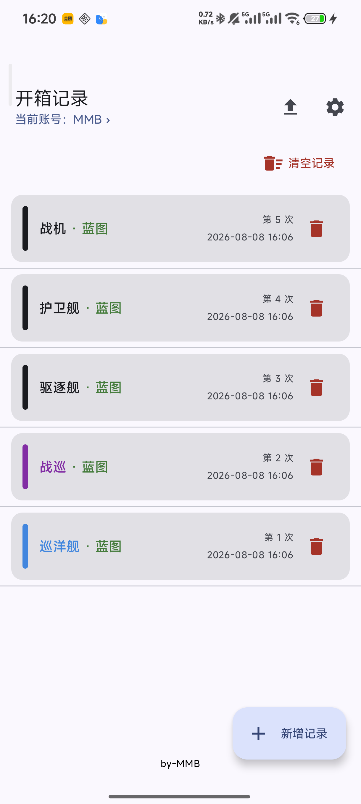
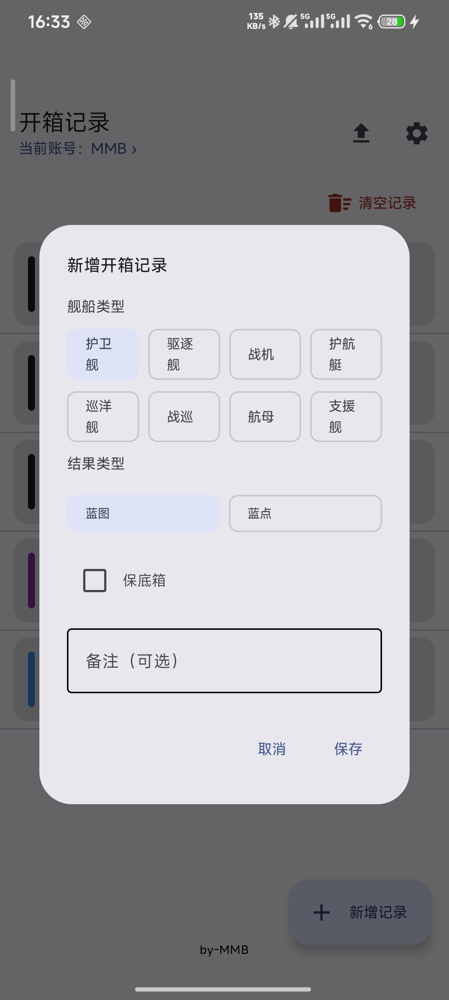
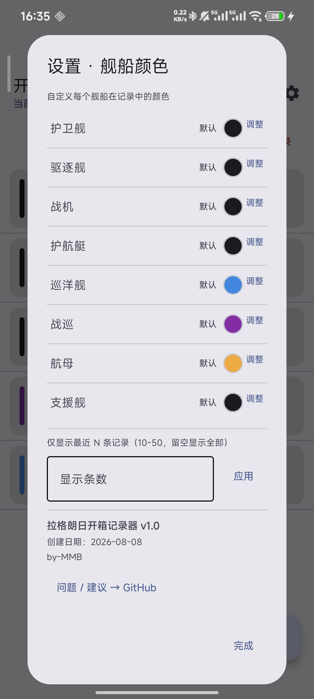

# 拉格朗日开箱记录器

记录《拉格朗日》开箱结果的本地工具，无需联网，数据保存在手机本地。

## 功能

- 多账号管理，各账号记录独立保存
- 开箱录入：舰船类型（8 种）、结果（蓝图/蓝点）、保底箱、备注
- 记录按时间倒序展示，舰船颜色可自定义
- 单条删除、一键清空（带二次确认）
- 可设置仅显示最近 10-50 条记录
- 导出当前账号记录为 txt

## 软件演示图

<p align="center">
  
  
  
</p>

## 安装

从 [Releases](https://github.com/MoonMoonBird0117/LGLR-Recorder/releases) 下载 APK 安装即可。

> 首次安装需允许"未知来源"。

### 文件校验（v1.0 正式版）

- **MD5**
  ```
  5130a77ec4181b737d78219b6cb1c8c2
  ```
- **SHA-256**
  ```
  96bdf97ece84c1663221984d2f3c509b53d94fecb799433ec77d7696b1e2b0ac
  ```

校验命令：`certutil -hashfile xxx.apk MD5` / `certutil -hashfile xxx.apk SHA256`（Windows）

## 协议

[MIT License](LICENSE) © [MoonMoonBird0117](https://github.com/MoonMoonBird0117)
